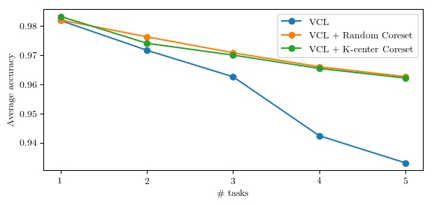
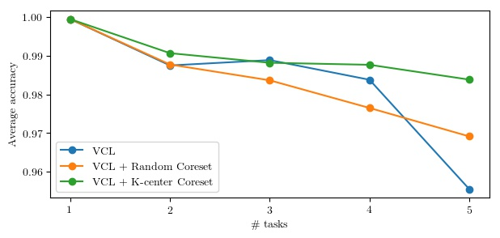

# Continual Learning for Deep Discriminative Models

This code is tested on Tensorflow 1.4.

**To run the Permuted MNIST experiment:**

	python run_permuted.py

**To run the Split MNIST experiment:**

	python run_split.py

The results will be saved to [results/](results/). They should be similar to the following figures:

 Permuted MNIST 

  

 Split MNIST 

 
	Split MNIST  
	 

